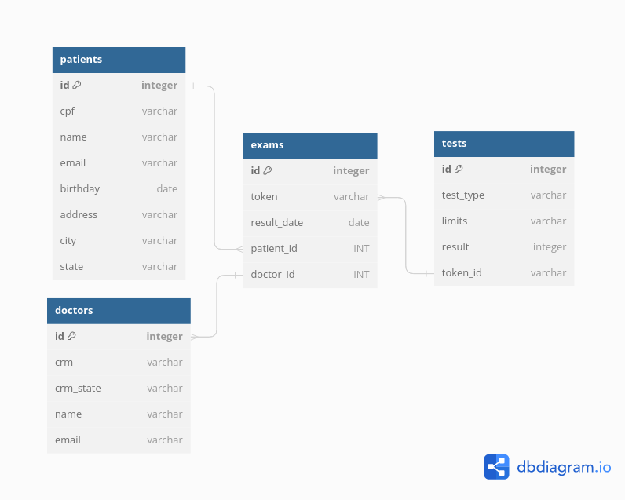
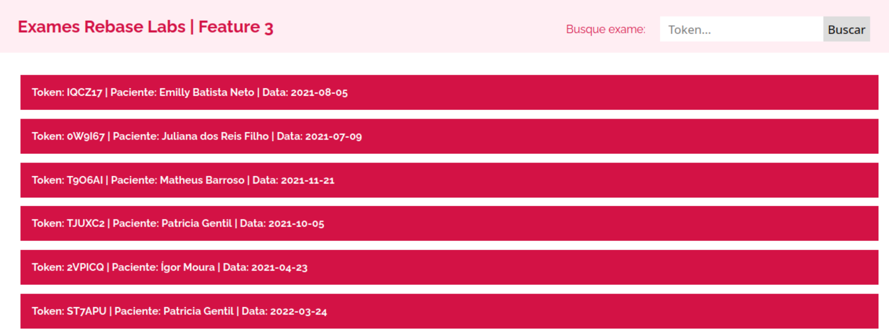
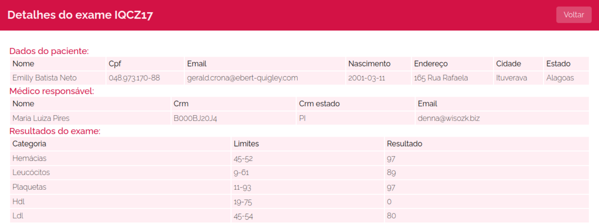
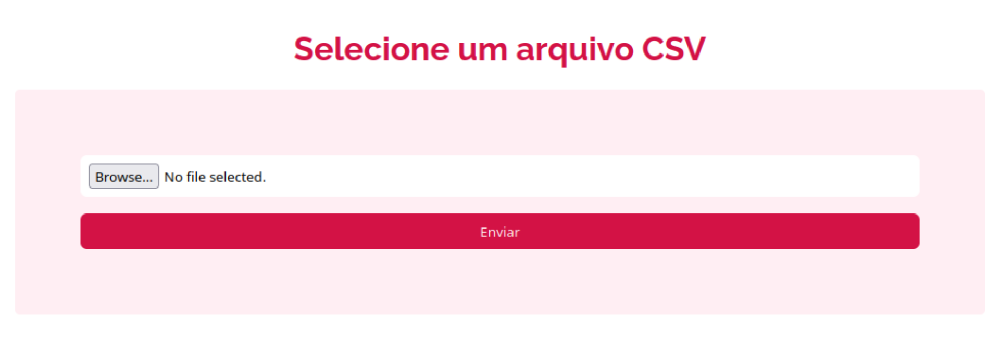
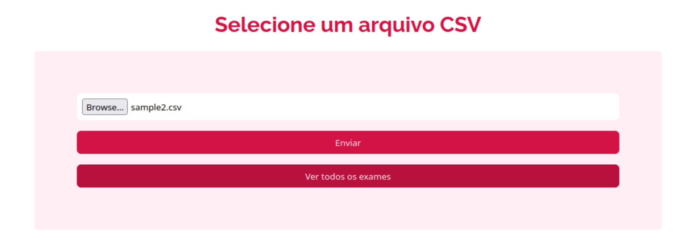

<h1 align="left">Rebase labs</h1>

Uma app web para listagem de exames médicos.

---

### Tech Stack


---


### Requisitos de sistema

* Docker

---

### Como rodar o projeto

Escolha um diretório no seu computador e execute o comando abaixo:

```
git clone git@github.com:Ricardonovais1/rebase_labs_redo.git
```
```
cd rebase_labs_redo
```

Rode todos os servidores - Cria uma rede e executa containers dentro dela:

```
docker compose up
```

Em outro terminal rode o comando abaixo para popular o banco de dados a partir do arquivo csv:

```
docker compose exec -it sinatra bash
```
```
ruby import_from_csv.rb
```
---

### Como testar o projeto

Até o momento temos testes apenas das API's de testes e de exames.

(Considerando que todos os containers estejam sendo executados:)

```
docker compose exec -it sinatra bash
```
```
bundle exec rspec
```
---
### Estrutura do banco de dados



Rotas para os endpoints do servidor 1:

#### * http://localhost:3000/api/tests --> Endpoint com todos os testes, reponse:

```
[{
            "id": "1",
            "cpf": "048.973.170-88",
            "nome paciente": "Emilly Batista Neto",
            "email paciente": "gerald.crona@ebert-quigley.com",
            "data nascimento paciente": "2001-03-11",
            "endereço/rua paciente": "165 Rua Rafaela",
            "cidade paciente": "Ituverava",
            "estado paciente": "Alagoas",
            "nome médico": "Maria Luiza Pires",
            "crm médico": "B000BJ20J4",
            "crm médico estado": "PI",
            "email médico": "denna@wisozk.biz",
            "token resultado exame": "IQCZ17",
            "data exame": "2021-08-05",
            "tipo exame": "hemácias",
            "limites tipo exame": "45-52",
            "resultado": "97"
}]
```
   #### * http://localhost:3000/api/exams --> Endpoint com todos os exames e seus respectivos testes, response:

```
[
   {
        "token resultado exame": "IQCZ17",
        "nome paciente": "Emilly Batista Neto",
        "data exame": "2021-08-05",
        "cpf": "048.973.170-88",
        "email paciente": "gerald.crona@ebert-quigley.com",
        "data nascimento paciente": "2001-03-11",
        "endereço/rua paciente": "165 Rua Rafaela",
        "cidade paciente": "Ituverava",
        "estado paciente": "Alagoas",
        "médico responsável": {
              "nome médico": "Maria Luiza Pires",
              "crm médico": "B000BJ20J4",
              "crm médico estado": "PI",
              "email médico": "denna@wisozk.biz"
        },
        "testes deste exame": [
              {
                    "tipo exame": "hemácias",
                    "limites tipo exame": "45-52",
                    "resultado": "97"
              },
              {
                    "tipo exame": "leucócitos",
                    "limites tipo exame": "9-61",
                    "resultado": "89"
              },
              {
                    "tipo exame": "plaquetas",
                    "limites tipo exame": "11-93",
                    "resultado": "97"
              },
              {
                    "tipo exame": "hdl",
                    "limites tipo exame": "19-75",
                    "resultado": "0"
              },
              {
                    "tipo exame": "ldl",
                    "limites tipo exame": "45-54",
                    "resultado": "80"
              },
              {
                    "tipo exame": "vldl",
                    "limites tipo exame": "48-72",
                    "resultado": "82"
              },
              {
                    "tipo exame": "glicemia",
                    "limites tipo exame": "25-83",
                    "resultado": "98"
              },
              {
                    "tipo exame": "tgo",
                    "limites tipo exame": "50-84",
                    "resultado": "87"
              },
              {
                    "tipo exame": "tgp",
                    "limites tipo exame": "38-63",
                    "resultado": "9"
              },
              {
                    "tipo exame": "eletrólitos",
                    "limites tipo exame": "2-68",
                    "resultado": "85"
              },
              {
                    "tipo exame": "tsh",
                    "limites tipo exame": "25-80",
                    "resultado": "65"
              },
              {
                    "tipo exame": "t4-livre",
                    "limites tipo exame": "34-60",
                    "resultado": "94"
              },
              {
                    "tipo exame": "ácido úrico",
                    "limites tipo exame": "15-61",
                    "resultado": "2"
              }
      ]
   }
]
```

---

#### Página com todos os exames (puxado do banco de dados), com input de pesquisa por token - http://localhost:3000/exams



#### Página de detalhes do exame - http://localhost:3000/exams/:token




#### Página onde o usuário pode fazer o upload de um arquivo csv com dados dos exames - http://localhost:3000/csv-upload



#### Após enviar arquivo aparece botão para ver a página com todos os exames - http://localhost:3000/exams

